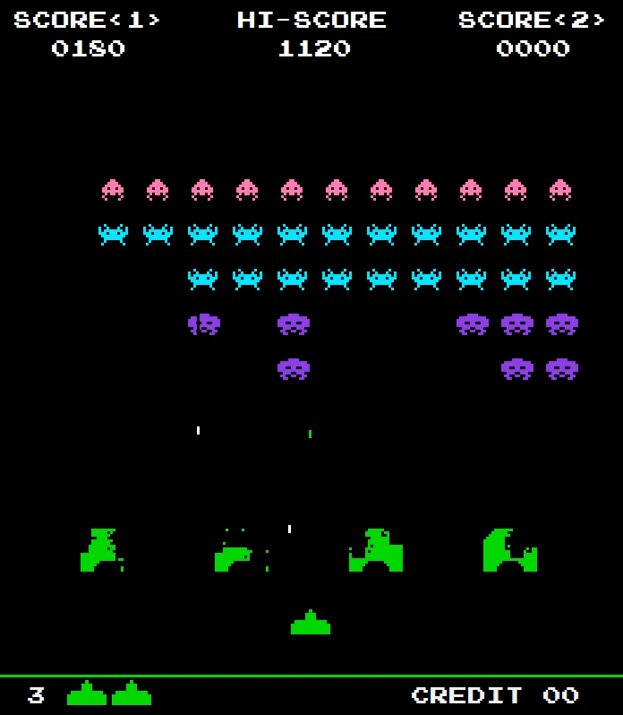

# 
Kosmiczni Najeźdźcy

 Prosta gra inspirowana hitem Atari "Space Invaders" z 78 roku. 

### Cel rozgrywki:

Strzelanie zielonym statkiem kosmicznym w przeciwników, którzy przyśpieszają swój ruch na boki wraz ze spadkiem ich ilości.
Gracz ma trzy życia widoczne w lewym dolnym rogu ekranu.

### Sterowanie

- Ruch w lewo - A / ←
- Ruch w prawo - D / →
- Strzał - Spacja

### Menu główne

### Ekran gry

## Zastosowane technologie

- C#
- .NET 6.0
- Windows Forms
